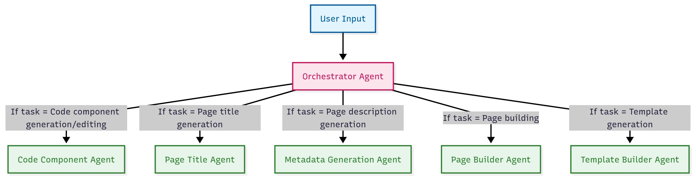

# AI Integration — In Canvas and Across Drupal

The AI features include generating complete websites from text prompts using Canvas components, an admin chatbot to assist with site building, and AI-powered alt text generation for images.
We'll be looking at how the AI features are set up and how they can be integrated into a commonsense workflow and the AI dashboard

<a href="https://www.qed42.com/insights/inside-drupal-canvas-ai-how-agents-turn-prompts-into-pages">Explanation from QED42</a>

-----

* [Byte theme](3-byte.md)

* [Back to first](index.md)

## [> Home](../README.md)
